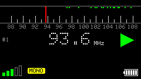
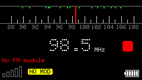
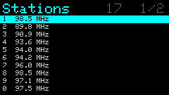

#  Sparks

**中文** | [English](./README.en.md)

为 Cardputer-ADV 制作的个人固件（**v1.11**），主要功能是米家设备控制、红外 / 空调自动化、Cursor 信息查看。

_该固件内容为全英文，英文缩写比较多，所以需要有良好的英语基础才能比较方便的使用。_

## 一、功能说明
基于 M5Stack 的库进行的开发，功能有：

任意界面若不清楚如何操作，按 `h` 可查看 Help。

| App | 英文名 | 快捷按键 | 功能 |
|-----|--------|----------|------|
| 米家 | Mijia | `m` | 设备状态查看、控制，支持热键快速切换 |
| AP/LAN | Config | `u` | Web 配置服务，针对 `config.json` 的修改 |
| WiFi | WiFi | `w` | WiFi 设置，支持多组配置选择 |
| 时钟 | Time | `t` | 开机时间、实时时钟、秒表、倒计时（全屏） |
| 休眠 | Sleep | `s` | 不关机的状态下，浅睡、深睡 |
| 系统配置 | Options | `o` | 屏幕、音量、时钟、日历、红外等首选项 |
| 系统信息 | Info | `i` | 内存、存储、芯片、固件、网络、运行信息 |
| 电池 | Battery | `p` | 实时电量与过去 12 小时电量曲线 |
| Cursor | Cursor Dashboard | `c` | Cursor 信息查看，TOKEN 余量，使用概况（24h / 7d / 30d） |
| 日历 | Calendar | `a` | 单月日历，翻月 / 翻年，今日高亮 |
| 版本 | Version | `v` | 固件版本与关于页 |
| 摩斯密码 | Morse | `j` | 按键出摩斯码音频 |
| 红外 | Infrared | `x` | 电视、空调红外遥控，适配主流品牌 |
| 空调自动化 | AC Auto | `n` | BLE 温湿度触发红外开关空调 |
| 键盘 | HID Keyboard | `k` | 蓝牙、USB 键盘 |
| 小游戏 | Mini Games | `g` | 扫雷、贪吃蛇、生命游戏、粒子时钟等 14 项 |
| 硬件测试 | Hardware Test | `h` | Display / IMU / Font / Icons / LED / BLE / I2C / Mic |
| 收音机 | Radio | `r` | Grove FM 收音机（TEA5767 / RDA5807M） |

## 二、文档
固件详细功能说明：

- 中文：[在线文档](https://kylebing.github.io/m5stack-cardputer-sparks/)
- English: [Docs](https://kylebing.github.io/m5stack-cardputer-sparks/en/)

## 三、Flash 划分与占用

Cardputer-ADV（StampS3）片上 Flash 为 **8 MB**，分区表为仓库内 `partitions/no_ota_8MB.csv`（无 OTA 双槽，与 Release 合并镜像一致）。

| 分区 | 起始地址 | 大小 | 用途 |
|------|----------|------|------|
| bootloader | `0x0` | 约 32 KB 预留 | 启动引导 |
| partitions | `0x8000` | 4 KB | 分区表 |
| nvs | `0x9000` | 20 KB | 非易失键值（WiFi 等） |
| otadata | `0xE000` | 8 KB | 引导兼容区（本固件不使用 OTA） |
| **app0** | `0x10000` | **3.19 MB**（3264 KB） | 运行固件（factory） |
| **spiffs / LittleFS** | `0x340000` | **4.69 MB**（4800 KB） | 文件系统（`config.json`、图标、日志、截图等） |
| coredump | `0x7F0000` | 64 KB | 崩溃转储 |

烧录偏移与 Release 说明一致：程序 `0x10000`，资源 `0x340000`，整片 `0x0`。

### 当前占用（v1.11 本地构建参考）

| 项 | 已用 | 分区容量 | 占用率 |
|----|------|----------|--------|
| 固件（Sketch / app0） | 约 **2.49 MB**（2551 KB） | 3.19 MB | **约 78%** |
| LittleFS 打包资源（`data/`） | 约 **0.66 MB**（671 KB，约 244 个文件） | 4.69 MB | **约 14%** |

说明：

- 固件体积随功能增减会变；设备上可在 **Info → Memory** 查看 Sketch / LittleFS 实时进度条。
- LittleFS 镜像整区为 4.69 MB；上表「已用」按源资源文件合计，实际盘内还会有文件系统元数据与运行期写入（配置、日志、截图、游戏记录等）。
- 改分区后需重刷分区表 + 固件 + LittleFS（`upload` 与 `uploadfs`，或整片 `merged.bin`）；旧布局下的 FS 数据不会自动迁移。

## 四、固件刷写
参见： [release 页面](https://github.com/KyleBing/m5stack-cardputer-sparks/releases)

## 五、对 Cardputer 的喜爱
一直非常喜欢像素屏，尤其那种低功耗的单色像素屏，像诺基亚那种，靠反射光线看内容的更好。  
前段时间想自己攒一个小设备出来，带个低功耗的这种屏幕，然后实现一些自己感觉比较好玩的功能。后来算了算，弄下来还不如直接买个手表划算了，就没有再弄。  

但这个想法一直在，通过跟 gemini 的聊天，把我导向了 M5Stack 的相关产品，最初是看上了那个 [Stick](https://shop.m5stack.com/products/m5sticks3-esp32s3-mini-iot-dev-kit)。  
有个不好的点是，像这种小设备，按键数量非常有限，用四个方向键或更少键来导航菜单的操作，非常的繁琐，更何况是在那种非常廉价的按键上面去实现这种操作，交互上就比较反人类。  
后来又看到 M5Stack 有 [Cardputer](https://shop.m5stack.com/products/m5stack-cardputer-adv-version-esp32-s3) ，跟 Stick 相比，有丰富的按键，非常不错。  
之前就一直喜欢黑莓手机里的全键盘，黑莓有自己的一套字母启动映射，比如，按 O 进入系统设置。Cardputer 有这么多按键就能非常方便的作为 app 启动器，直接一个字母固定一个 app，能非常方便的进入不同 app，实现多功能快速启动。
拿到这个设备之后，感觉实现自己想法像有了地基一样，就把自己喜欢的小工具和想法都做到了这上面，后面有了新想法再往上加。  

像 Cardputer 这种基于 ESP32 的工具，固件就是一套非常死的固定程序，启动速度就会很快，这一点我非常喜欢。要比安卓、linux 启动都要快，很爽。我这个固件也专门对此作了优化，开机时间就在 1 秒。

非常喜欢用它来控制家里的米家设备，替换傻傻的小爱同学。
