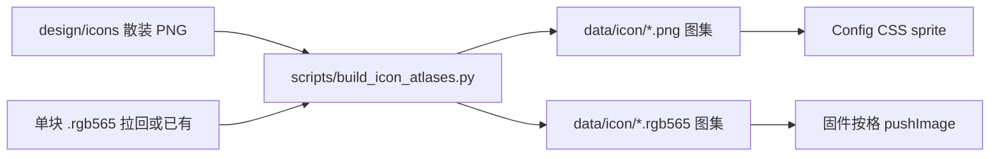

# Icon 图集改造计划

> **状态：暂缓** — 方案已定，真需要省 LittleFS / 减小文件数时再实施。  
> 当前仍使用 `data/icon/` 下散装 PNG + `.rgb565`，固件与网页可照常使用。  
> 保存日期：2026-08-08

## 概述

把设备 / 空调 / 品牌散装图标收成少量双列（或单列）长图图集，用一张名单表维护顺序（含原文件名）；固件按格读 RGB565，网页用 PNG + `background-position`；用脚本从源图生成图集。

## 待办（实施时）

- [ ] 新增 `icon_atlas_manifest.json`（每行含 inactive/active 原文件名）+ `build_icon_atlases.py`
- [ ] 散装源图迁到 `design/icons/`；`data/icon/` 只保留图集产物
- [ ] device/IR/ac_auto 改为 atlas 按格绘制；更新 available/demo
- [ ] Config 页改用 `device_icon_70` CSS sprite + 同源名单
- [ ] 补齐缺失块 bake→拼 565→uploadfs/upload 验证
- [ ] 更新 `docs/dev/images.md` 图集与工作流说明

## 布局约定

统一：**行 = 条目下标，列0 = inactive/普通，列1 = active**（无 active 的图集只做单列）。

```text
[ inactive | active ]   ← 宽 = cell_w * cols
[ inactive | active ]
...
```

| 图集文件（PNG + 同名 `.rgb565`） | 格子 | 列 | 行数（约） |
|-------------------------------|------|----|-----------|
| `/icon/device_icon_70` | 70×70 | 2 | 13 |
| `/icon/device_icon_40` | 40×40 | 2 | 13 |
| `/icon/device_icon_25` | 25×25 | 2 | 13 |
| `/icon/ac_mode_30` | 30×30 | 2 | 6（mode×5 + power） |
| `/icon/ac_fan_34x30` | 34×30 | **1**（无 active） | 6 |
| `/icon/ac_send_57x38` | 57×38 | 2 | 1 |
| `/icon/brand_66x20` | 66×20 | **1**（无 active） | 11 |

根目录 `ap` / `lan` / `power` / `btngo_*` **暂不动**（未纳入本次）。

设备图集尺寸示意（70）：宽 140，高 `70 × 13 = 910` —— 超出现有屏级 bake（240×135），**不能整张上屏 bake**；565 由图块拼接得到。

## 单一维护表（顺序由这里定）

权威文件：`scripts/icon_atlas_manifest.json`。  
脚本据此拼图，并生成 `include/app_icon_atlas_gen.h` 给固件。

**每行必须带上源文件名**（相对 `design/icons/`），后续改图只查表替换对应文件，再重跑脚本。

示例结构：

```json
{
  "atlases": [
    {
      "id": "device_icon_25",
      "out": "data/icon/device_icon_25",
      "cell_w": 25, "cell_h": 25, "cols": 2,
      "rows": [
        {
          "name": "default",
          "inactive": "device/default_25w.png",
          "active": "device/default_active_25w.png"
        },
        {
          "name": "plug",
          "inactive": "device/plug_25w.png",
          "active": "device/plug_active_25w.png"
        }
      ]
    },
    {
      "id": "ac_fan_34x30",
      "out": "data/icon/ac_fan_34x30",
      "cell_w": 34, "cell_h": 30, "cols": 1,
      "rows": [
        { "name": "ac_fan_auto", "inactive": "ir/ac_fan_auto.png" }
      ]
    }
  ]
}
```

约定：

- `name`：逻辑名 / 固件与网页匹配用的 id
- `inactive` / `active`：**原 PNG 路径**（迁到 `design/icons/` 后仍用这套文件名）
- 单列图集无 `active` 字段
- bake 拉回的单块 `.rgb565` 与 PNG **同 stem**（仅扩展名不同），脚本拼 565 时按同一路径换扩展名查找

**设备行序（index = 行号，匹配仍按长名优先）：**

0. `default`
1. `airpurifier`
2. `wifispeaker`
3. `sensor_ht`
4. `bslamp2`
5. `juicer`
6. `camera`
7. `cooker`
8. `fryer`
9. `lamp2`
10. `light`
11. `plug`
12. `fan`

`deviceIconBasenameForModel` 仍用「长名在前」扫描；命中后查表得 **row index**。`default` 固定 row 0。

**空调 mode 行序：** `ac_auto`, `ac_cool`, `ac_dry`, `ac_fan`, `ac_heat`, `ac_power`  
**风速行序：** `ac_fan_auto`, `ac_fan_min`, `ac_fan_low`, `ac_fan_med`, `ac_fan_high`, `ac_fan_max`  
**发送：** row0 = `send_inactive` | `send_active`  
**品牌行序：** 与现 `src/app_ir.cpp` stem 列表对齐（midea→…→xiaomi 等 11 个 `brand_*`）

## 源文件与打包



- **源图**：从 `data/icon/{device,ir,brand}/` 迁到 `design/icons/`（仓库可编辑、**不进 LittleFS**）。文件名仍用现有逻辑名，例如 `design/icons/device/plug_25w.png`、`plug_active_25w.png`。
- **`data/icon/`**：只保留图集 PNG + `.rgb565`（以及根上未改的 ap/lan 等）。
- 旧散装从 `data/` **删除**（含单张 `.png` / `.rgb565`），只 upload 图集，避免再撑满 LittleFS。

### 后续改图：能定位、能替换吗？

**能。** 删的是 `data/` 里进设备的散装；**可编辑源图留在 `design/icons/`**。定位优先查 **`icon_atlas_manifest.json` 里该行的 `inactive` / `active` 原文件名**，再改对应 PNG。

| 你给的线索 | 怎么定位 |
|------------|----------|
| 设备名 / model（如 plug） | manifest 里 `name: "plug"` → 读出 `inactive`/`active` 路径 |
| 尺寸（25 / 40 / 70） | 对应 atlas `device_icon_*` 条目中的文件名 |
| 普通 / 激活 | `inactive` vs `active` 字段 |
| 空调 / 品牌 | 同上，查对应 atlas 的 rows |

**标准更新流程：**

1. 打开 `scripts/icon_atlas_manifest.json`，按 `name` 找到行，得到原文件名。
2. 替换 `design/icons/<原文件名>`。
3. 对该块 bake（staging → 设备 → pull 同 stem 的 `.rgb565`）。
4. 跑 `build_icon_atlases.py` 重拼图集 → `uploadfs`。

不需要在长图里手抠格子。

## 生成脚本

新增 `scripts/build_icon_atlases.py`：

1. 读 manifest，按行把左/右 PNG 拼成 atlas PNG（Pillow，仅用于网页/归档；黑底对齐现 UI）。
2. 若存在对应单块 `.rgb565`（从设备 pull 的缓存目录或 `design/icons` 旁），按相同几何竖拼成 atlas `.rgb565`（保留现有 8 字节 `R565` 头，宽高为整图）。
3. 写出/更新 `include/app_icon_atlas_gen.h`（名字、row、路径常量）。

**565 工作流（保持 M5GFX 画质）：**

1. 临时把需要 bake 的散装 PNG 放进 staging → `uploadfs` → `POST /bake-rgb565` → `pull_rgb565_from_device.py`
2. 脚本用拉回的块拼接 atlas → 提交 `data/icon/*` 图集
3. 正式产品 `data/` 不再含散装

（后续若要，可再加「分块 bake 长图」；本期不改 bake 上限。）

## 固件改动

- `src/app_device_icons.cpp`：`drawDeviceIconFor*` / List / Info 改为  
  `drawAtlasTile(path, row, active ? 1 : 0, cell_w, cell_h, x, y)`  
  —— `seek` 到对应格，**每次只读一格**，不整图进 RAM。
- `src/app_ir.cpp` / `src/app_ac_auto.cpp`：mode / fan / send / brand / power 改为读对应 atlas 格；现有「进入 IR 时 RAM 缓存 mode」可改为从 atlas 填槽，行为不变。
- `src/app_web.cpp`：`iconUrl` 改为 CSS sprite（`device_icon_70.png` + `background-position`）；`ICON_NAMES` 与 manifest 同源。
- `src/app_icon_demo.cpp`：demo 改为画 atlas 格。
- `deviceIconsAvailable()`：改查 `/icon/device_icon_25.rgb565`（或 png）是否存在。

## 网页

Config 设备列表图标：

```css
.dev-icon { width:28px; height:28px; background:url(/icon/device_icon_70.png) no-repeat;
            background-size: 56px auto; } /* 两列缩放 */
/* position: x = 0 或 -28px(active 一般不用), y = -row*28 */
```

仍只显示普通态（与现在一致）。

## 空间与性能（预期）

- 文件数：上百 → 约十来个图集 → LittleFS 块浪费大幅下降。
- RAM：按格读取 → **与现在单文件同级**；IR 仍可按需缓存小格。
- 绘制：565 直推，无额外 PNG 解码成本。

## 实施顺序

1. 写 manifest + `build_icon_atlases.py`，生成 PNG 图集并迁源图到 `design/icons/`
2. 用现有散装 `.rgb565`（若缺则 bake+pull）拼出 atlas `.rgb565` 写入 `data/icon/`
3. 固件改绘制 API + IR/品牌/Web/Demo
4. 删 `data/` 下散装，`uploadfs` + `upload` 验证列表 / Info / IR / Config
5. 短更 `docs/dev/images.md` 图集约定与脚本命令
